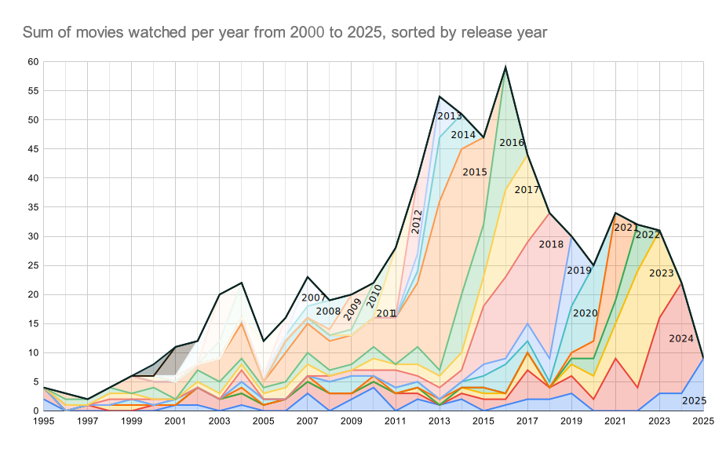

# Movies

Evaluate your media consumption

This project started in 2013. From that year on I took notes which movie I watched in which year. I got a 2-dimensional graph for the last 6 years of an ever growing number of movies. This chart of 7 years already indicates that we probably mostly watch recent movies.

Since I took a mark if I watched a movie, the database goes back to 1921 with more than 4500 movies. As of now I watched 1335 of them. But rarely a new movie from long ago makes it to the list. Or if it does, I've already seen it and it doesn't show up. We're just watching the classics ...

## Purpose of this repository

As with many data collections it started out as an excel worksheet. Over time the demand on the data extends the capabilties of a spreadsheet document. I want to convert it to a .csv data file and then start to analyse and extend in python on kaggle or colaboratory with a jupyter notebook. Goals:

- Find the associated IMDB number for this movie for future reference.
- Add a recent number of global revenue from boxofficemojo.
- Indicate the original language of the movie.

The last point came to my attention only in 2019 and 2020 when rather unknown movies made it into the top100 grossing movies of that year. Turns out that the movie market in China has grown in the years since I started this project in 2013 that their domestic market was strong enough to compete with Hollywood.

BTW: I included some german movies that were not really recognized somewhere else in the world.

## Update 2025

By now my movie list has 5000 entries and I watched more than 1500 of them.

And just how many movies I watch per year:

