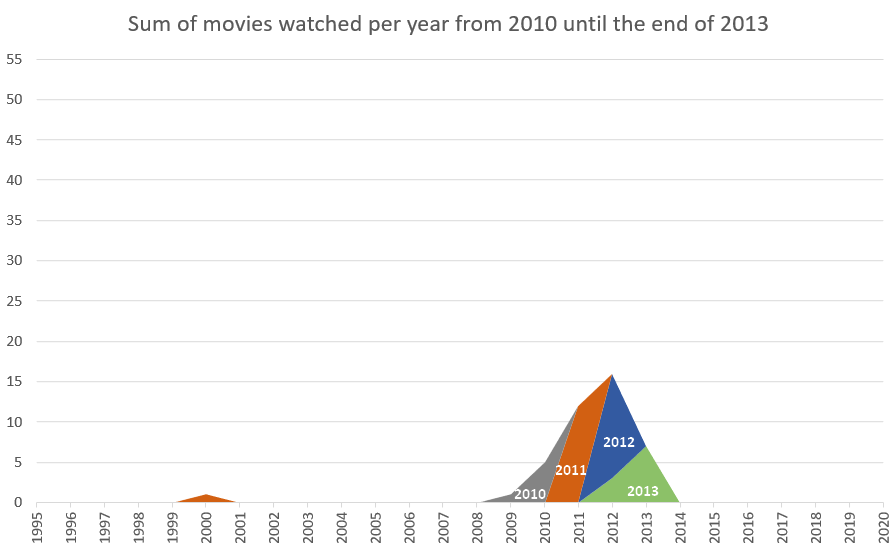
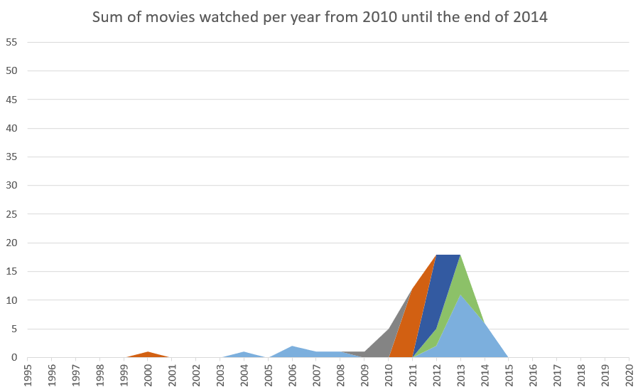
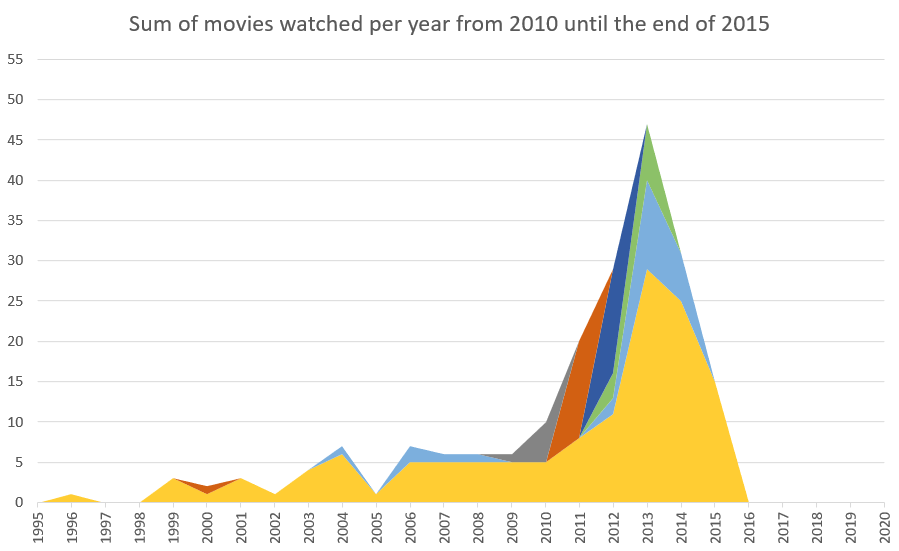
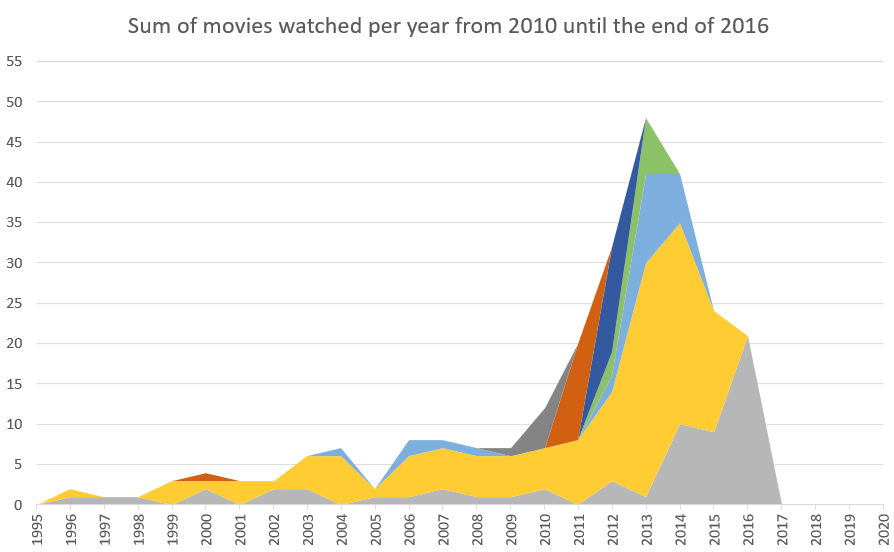
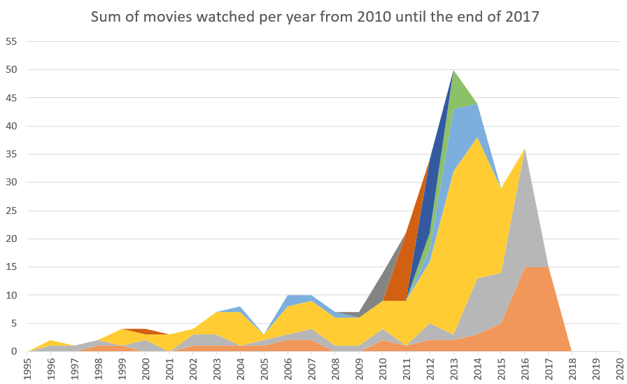
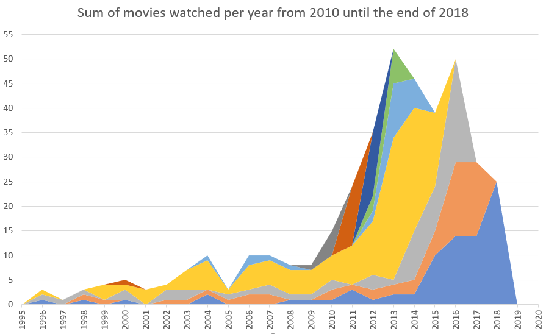

# Documentation of movie consumption

Most of us watch a lot of movies. Concepts and key lines are used for cultural reference. Many of my friends refer to movies quite often, so I decided to review my [on consumption](https://hofkoh.de/2014/10/filmliste/). Starting in 2013 I recorded every movie I watched. Published [October 2014](https://hofkoh.de/2015/06/medienkonsum-die-zweite/). For some movies I could remember to have seen them in the cinema. This is a graph of recent movies according to their release year and the year I watched them:

Since I took a mark if I watched a movie, the database goes back to 1921 with more than 4500 movies. As of now I watched 1335 of them. But rarely a new movie from long ago makes it to the list. Or if it does, I've already seen it and it doesn't show up. We're just watching the classics ...

And in some years I have more time to go to the movies, or stream it at home - starting 2015:

## Purpose of this repository

As with many data collections it started out as an excel worksheet. Over time the demand on the data extends the capabilties of a spreadsheet document. I want to convert it to a .csv data file and then start to analyse and extend in python on kaggle or colaboratory with a jupyter notebook. Goals:

- Find the associated IMDB number for this movie for future reference.
- Add a recent number of global revenue from boxofficemojo.
- Indicate the original language of the movie.

The last point came to my attention only in 2019 and 2020 when rather unknown movies made it into the top100 grossing movies of that year. Turns out that the movie market in China has grown in the years since I started this project in 2013 that their domestic market was strong enough to compete with Hollywood.

BTW: I included some german movies that were not really recognized somewhere else in the world.

## Progress in 8 years

Since I started this project in 2013 I collected a lot of data on my movie culture. See how it evolved over a period of 8 years:

## Update 2025

By now my movie list has 5000 entries and I watched more than 1500 of them.

And just how many movies I watch per year:

And finally how many of the movies released in a certain year I watched:

## History

This project started 2014 on hofkoh.de. Here are the two posts from that time (https://hofkoh.de/2014/10/filmliste/ and https://hofkoh.de/2015/06/medienkonsum-die-zweite/):

### Filmliste 2014/10/26

Immer wieder werden mir Filme empfohlen, die ich „unbedingt gesehen haben muss“. Gleichzeitig kann ich selten auf gemeinsame Filmzitate zurückgreifen, weil der jeweils andere den Film nicht gesehen hat. So kam irgendwann die Idee auf, eine Filmliste zu erstellen. Hier ist die passende Datei im Excelformat und hier im ODS-Format (OpenOffice und LibreOffice).

Die Liste umfasst mitlerweile 3800 Filme, die vornehmlich aus den TOP100 der vergangenen 34 Jahre auf Basis von boxofficemojo.com  zusammengestellt ist. Natürlich fehlen einige wichtige Filme 😉 Hinterlasst mir dazu einfach einen Kommentar, dann gibt’s ein Update. Meine 904 gesehenen Filme habe ich nach Jahren sortiert noch weiter ausgewertet:

In den letzten Jahren haben ich wohl 30-40 Filme pro Jahr gesehen, ein Teil davon nicht unbedingt im Kino, sondern auf DVD oder im Fernsehen. Vor 1985 ist es allerdings recht dünn. Fernsehfilme sind natürlich ebensowenig enthalten wie Serien, Computerspiele, Handygames und Konsolenspiele. Listen dazu folgen später.

**Comment:**

> Nadine: Ich sage nur “ ich Nummer 1, Du Nummer 2… 2015/06/16

Macht man nix. Laut boxofficemojo.com gibt es Mitte 2016 insgesamt 645 Filme, die weltweit mehr als 200 Millionen Dollar eingespielt haben. In den Top 10 finden sich erstaunlich viele Filme der letzten Jahre oder gar des letzten Jahres.

### Medienkonsum die Zweite 2015/06/09

Natürlich kann man sehr viel Zeit mit Kinofilmen verbringen, aber das ist nichts im Vergleich zu Serien, Soaps, Dokus, Animes und Zeichentrickfilmen im Fernsehen. Passend zum alten Projekt habe ich also eine erste Liste mit 192 Serien der vergangenen Jahre aufgestellt. Solltet Ihr meinen, dass eine wichtige Serie fehlt, dann schreibt es einfach in den Kommentar, es wird aktualisiert. So sind aber schon mal 129139 Episoden enthalten, also 92462 Stunden Unterhaltung. Man bräuchte 10 1/2  Jahre, um alle Episoden ohne Unterbrechung hintereinander zu schauen. Hier ist die Liste.

Auch die alte Liste mit Kinofilmen habe ich aktualisiert, sie enthält jetzt 4000 Filme bis 2015: Datei als XLSX.

Ganz will ich die Listen aber nicht vervollständigen. Das hat auch mit dem inflationären Anzahl von Serien zu tun, welches durch Eigenproduktionen von Netflix, Amazon und watchever noch beschleunigt wird. Dazu ein Detail aus Wikipedia zu Serien, die einen eigenen Artikeln haben:

- 1940er – 3 Serien
- 1950er – 67 Serien
- 1960er – 239 Serien
- 1970er – 402 Serien
- 1980er – 626 Serien
- 1990er – 931 Serien
- 2000er – 1671 Serien
- 2010er – erst 1422 Serien, aber es bleiben noch 5 Jahre …
  
Soweit zu Filmen und Serien. Jetzt fehlt noch eine Liste mit Computerspielen. Ob hier jemand noch einen ZX81, Atari 600XL oder KC 85/3 kennt? Und dann Konsolen, PS3, PS4, XBOX, iPod touch, Android und iPhone und Tablets – es wird endlos! Nicht zu vergessen den PC und Prince of Persia auf einem 286er mit 20MHz.

**Comment:**

Wo ist denn Homeland, The Closer, Monk, Downton Abbey, Dexter, Gilmore Girls, McLeods Töchter, Chigago Fire, Fringe, CSI: Cyber, Crossing Jordan, Criminal Intent, die 7 Reihen des „Es war einmal …“, Seinfeld und Die Sopranos? 2015/06/09
